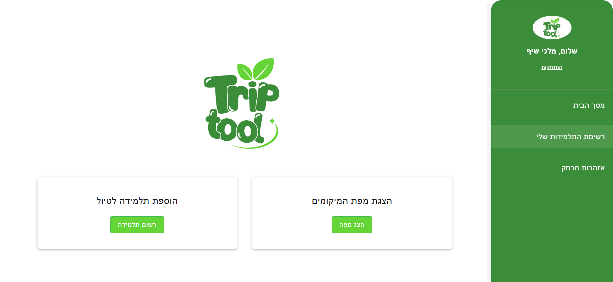
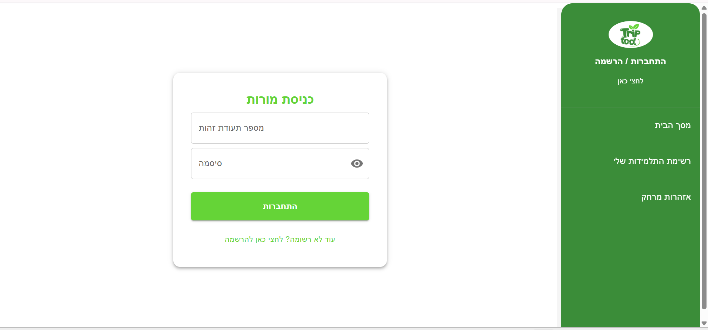
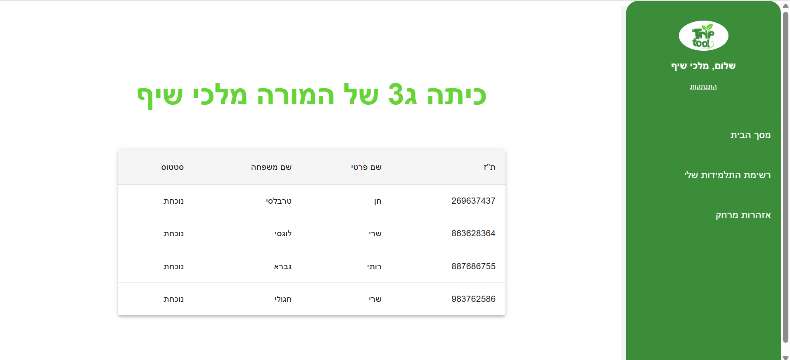
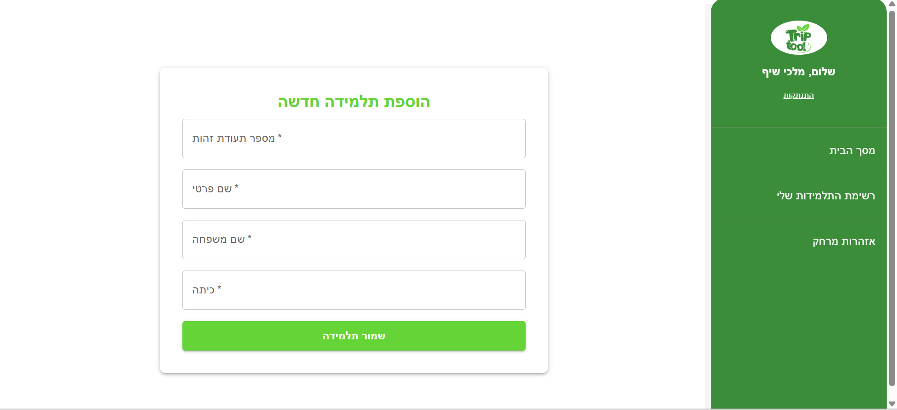
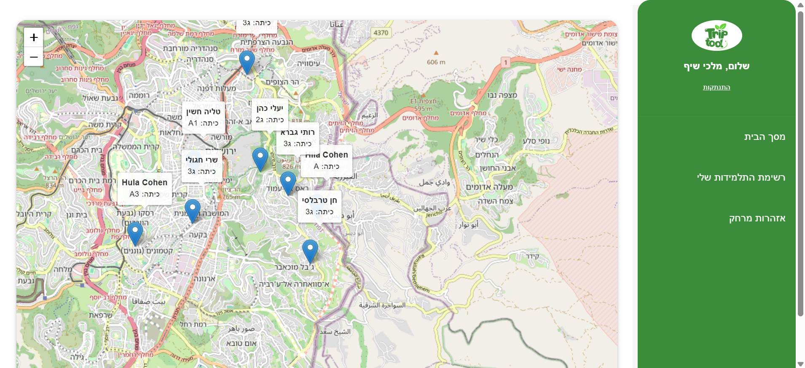
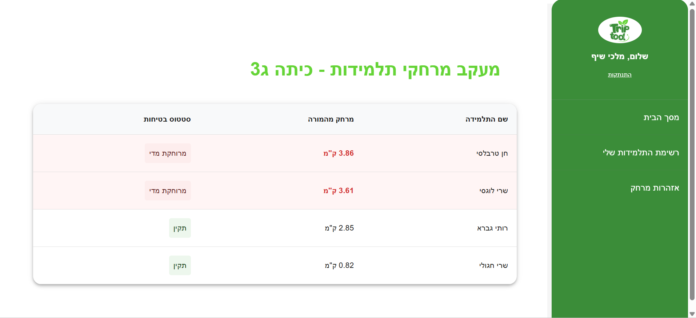

📍 Trip Tool - מערכת ניהול ובקרת טיולים לבית ספר
המערכת מיועדת למורים ומורות בבית ספר על מנת לארגן יציאה לטיולים. המערכת מאפשרת אזור אישי לכל מורה שבו יוכלו לצפות ברשימה מסודרת של כל התלמידים שבכיתתם שנמצאים בטיול.
כמו כן המערכת משודרגת בפיצ'ר מיוחד שמקבל מיקומים של תלמידות בזמן אמת ממכשירי איכון שניתנו להן, המערכת מציגה את כל התלמידות על גבי מפה ויזואלית ונותנת אפשרות למורה לעקוב אחר מיקומן ולוודא שאין תלמידות שהתרחקו מדי.

🛠️ Technologies & Dependencies (תלויות חיצוניות)
כדי להריץ את הפרויקט, יש לוודא שמותקנות התלויות הבאות:

Backend (Java Spring Boot)
Java JDK 17 ומעלה.

Maven (לניהול תלויות והרצת הפרויקט).

SQL Database (MySQL / PostgreSQL וכו') – יש לוודא ששרת ה-SQL פעיל.

Lombok – מומלץ להתקין Plugin ב-IDE לקיצור כתיבת קוד.

Spring Boot Starter Data JPA – לחיבור למסד הנתונים.

Frontend (React)
Node.js (גרסה 16 ומעלה) ו-npm.

Material UI (@mui/material) – עבור רכיבי הממשק והעיצוב.

Leaflet & React-Leaflet – הספרייה להצגת המפות (OpenStreetMap).

Axios – לביצוע קריאות ה-API מול השרת.

📖 אופן השימוש (User Guide)
דף הבית והתחברות (Login): עם הכניסה למערכת, המורה מגיעה לדף הבית ומשם עוברת לדף ההתחברות להזנת פרטיה.

צילום מסך: דף הבית 

צילום מסך: דף ההתחברות 

ניהול תלמידות: המורה יכולה לצפות ברשימת התלמידות המשויכות לכיתתה ולהוסיף תלמידות חדשות למערכת.

צילום מסך: רשימת תלמידות 

צילום מסך: טופס הוספת תלמידה 

מעקב מפה: תצוגה ויזואלית של כל התלמידות על גבי המפה בזמן אמת. המפה מתעדכנת אוטומטית.

צילום מסך: תצוגת מפה 

אזהרות בטיחות: מערכת חישוב מרחקים המתריעה על תלמידות מרוחקות מדי (מעל 3 ק"מ).

צילום מסך: טבלת אזהרות מרחק 

⚙️ How to Run
Backend
נווטי לתיקיית BackEnd-Trip-Manager.

פתחי את קובץ src/main/resources/application.properties ועדכני את פרטי החיבור ל-SQL שלך (URL, Username, Password).

הריצי בטרמינל: mvn spring-boot:run.

Frontend
נווטי לתיקיית hadasim-trip-frontend.

התקיני את כל הספריות: npm install.

הריצי את הפיתוח: npm run dev.

פתחי את הדפדפן בכתובת: http://localhost:5173.

💡 הנחות מקלות
מיקום המורה: לצורך החישובים, מיקום המורה מוגדר כנקודת מוצא קבועה בשרת.

אבטחה: האימות מבוסס על בדיקת ת"ז וסיסמה מול מסד הנתונים (ללא שימוש ב-JWT).

סימולטור: תנועת התלמידות במפה מופעלת על ידי רכיב סימולציה פנימי המעדכן קואורדינטות באופן אקראי ב-Database.

👩‍💻 Author
Yael Attia